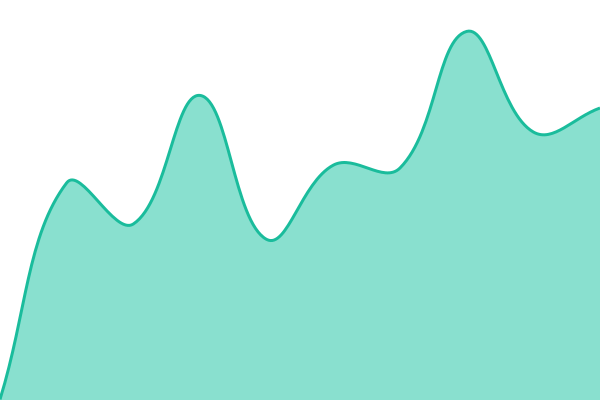
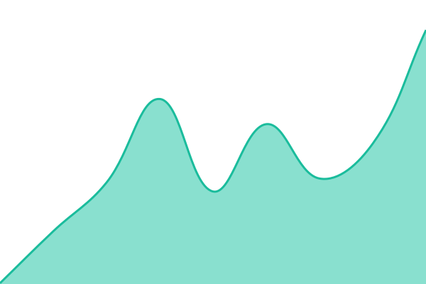
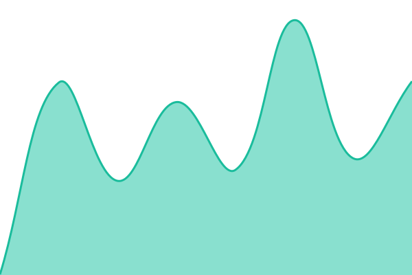
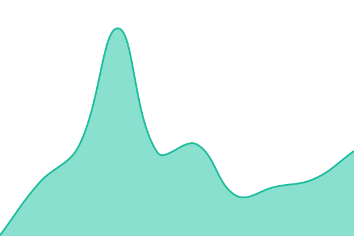

# [📈 Live Status](https://Bardinator.github.io/my-ohana-status): <!--live status--> **Everything is working**

This repository contains the open-source uptime monitor and status page for [Bardinator](https://Bardinator.github.io/my-ohana-status), powered by [Upptime](https://github.com/upptime/upptime).

With [Upptime](https://upptime.js.org), you can get your own unlimited and free uptime monitor and status page, powered entirely by a GitHub repository. We use [Issues](https://github.com/Bardinator/my-ohana-status/issues) as incident reports, [Actions](https://github.com/Bardinator/my-ohana-status/actions) as uptime monitors, and [Pages](https://Bardinator.github.io/my-ohana-status) for the status page.

<!--start: status pages-->
<!-- This summary is generated by Upptime (https://github.com/upptime/upptime) -->
<!-- Do not edit this manually, your changes will be overwritten -->
<!-- prettier-ignore -->
| URL | Status | History | Response Time | Uptime |
| --- | ------ | ------- | ------------- | ------ |
|  [Website](https://www.myohana.co.uk) | 🟩 Up | [website.yml](https://github.com/Bardinator/my-ohana-status/commits/HEAD/history/website.yml) | 

 438ms
     
 | 

<a href="https://status.myohana.co.uk/history/website">100.00%</a>
    

|  [Enquiries, CRM & content](https://www.myohana.co.uk/api/health) | 🟩 Up | [enquiries-crm-and-content.yml](https://github.com/Bardinator/my-ohana-status/commits/HEAD/history/enquiries-crm-and-content.yml) | 

 190ms
     
 | 

<a href="https://status.myohana.co.uk/history/enquiries-crm-and-content">100.00%</a>
    

|  [Nursery pages](https://www.myohana.co.uk/nurseries) | 🟩 Up | [nursery-pages.yml](https://github.com/Bardinator/my-ohana-status/commits/HEAD/history/nursery-pages.yml) | 

 281ms
     
 | 

<a href="https://status.myohana.co.uk/history/nursery-pages">100.00%</a>
    

|  [Sanity Studio](https://www.myohana.co.uk/studio) | 🟩 Up | [sanity-studio.yml](https://github.com/Bardinator/my-ohana-status/commits/HEAD/history/sanity-studio.yml) | 

 125ms
     
 | 

<a href="https://status.myohana.co.uk/history/sanity-studio">100.00%</a>
    

<!--end: status pages-->

[**Visit our status website →**](https://Bardinator.github.io/my-ohana-status)

## 📄 License

- Powered by: [Upptime](https://github.com/upptime/upptime)
- Code: [MIT](./LICENSE) © [Anand Chowdhary](https://anandchowdhary.com)
- Data in the `./history` directory: [Open Database License](https://opendatacommons.org/licenses/odbl/1-0/)
